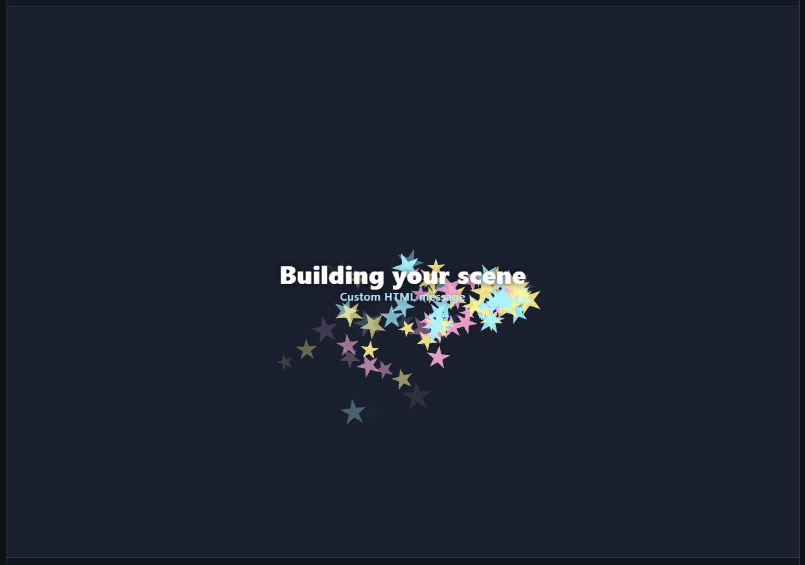
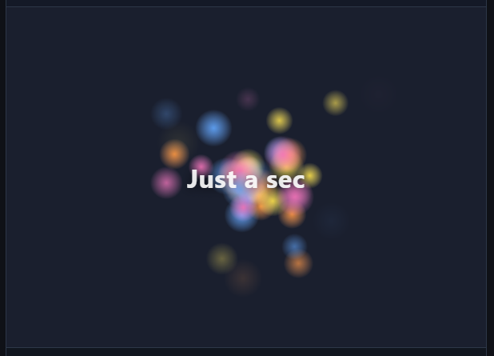

# 3d-spinner and beyond

[](https://github.com/runelaang/3d-spinner/actions/workflows/ci.yml)
[](https://www.npmjs.com/package/3d-spinner)
[](https://bundlephobia.com/package/3d-spinner)
[](LICENSE)

A zero-dependency 3D spinner, loader, and progress indicator for the browser. It renders to a
canvas and ships primarily as ES modules split across separate import paths, so a consumer loads
only the animation, motion path, and rendering backend they actually use - nothing else is pulled
in. CommonJS and a browser-global build are also published; see [Module formats](#module-formats).

## Screenshots

| `starSwarm` with custom HTML | `pulsingStarfield` | `chargedOrb` at 74% |
| --- | --- | --- |
|  |  |  |

| `ghostTrain` progress prefab | `ParticlesAnimation` with glow texture |
| --- | --- |
|  |  |

## Install

```sh
npm install 3d-spinner
```

## Quick start

A spinner is a renderer (the `animation`) plus a mode. The simplest case is an indeterminate
spinner that runs until you stop it:

```js
import { createSpinner } from "3d-spinner";
import { SpinAnimation } from "3d-spinner/animations/spin";

const spinner = createSpinner(document.getElementById("app"), {
  type: "indeterminate",
  animation: new SpinAnimation(),
});

// When the work is done:
spinner.stop();    // play the outro, then stop (leaves the element in place)
spinner.destroy(); // stop now and remove the element
```

## Reporting progress

Drop the `type` (it defaults to `"progress"`) and report progress yourself as work completes.
Give `SpinAnimation` a `progressAnimation` to make it pop in, scale with progress, and show a
label:

```js
import { createSpinner } from "3d-spinner";
import { SpinAnimation } from "3d-spinner/animations/spin";

const spinner = createSpinner(document.getElementById("app"), {
  animation: new SpinAnimation({ progressAnimation: {} }),
});

spinner.setProgress(0.4); // smoothly advances toward 40%
spinner.setProgress(1);   // reaching 1 plays the outro
```

## Choosing a shape

`SpinAnimation` spins a cube by default. Pass any built-in shape, or your own mesh:

```js
import { SpinAnimation } from "3d-spinner/animations/spin";
import { tetrahedron } from "3d-spinner/engines/little-3d-engine";

new SpinAnimation({ shape: tetrahedron(), color: "#3b82f6" });
```

Shapes exported from `3d-spinner/engines/little-3d-engine` include `cube`, `tetrahedron`,
`octahedron`, `pyramid`, `quad`, and several spheres (`uvSphere`, `icosphere`, `octaSphere`,
`cubeSphere`).

## How it fits together

A spinner is assembled from a few independent pieces, so you can swap one without touching the
others:

- **`createSpinner`** mounts the spinner into an element and runs a single animation loop.
- **Spinner type** decides how progress is driven. `progress` is determinate - you report a value
  from 0 to 1 with `setProgress`. `indeterminate` is self-driving - it loops a synthetic progress
  on a timer until you `stop()`. Any animation works with either type.
- **Animation** is the visual that plays (a spinning shape, a moving object). Each one lives at its
  own import path, so you load only the animation you use.
- **Intro and outro** are the entrance and exit. The loop plays the intro once when the spinner
  starts and the outro when it finishes - progress reaching 1, or `stop()`. `destroy()` skips the
  outro and removes the element immediately.
- **Motion controller** (for `ObjectMotionAnimation`) is a small, separate object that decides
  *how* a thing moves - a circle, square, figure-8, or wander. Swap the controller to change the
  path without changing the animation.
- **Transition** (for `ObjectMotionAnimation`) is the intro/outro effect - by default the object
  flies in and out along the path; grow or shrink in place is available as an option.
- **The 3D engine** is the renderer underneath: a small, dependency-free engine that draws shapes
  and meshes to a canvas, with swappable Canvas 2D, WebGL, and WebGPU backends.

## Animations

Each animation is imported from its own subpath, so you only pull in the one you use.

| Import | Class | Description |
| --- | --- | --- |
| `3d-spinner/animations/spin` | `SpinAnimation` | A spinning 3D shape, a cube by default. |
| `3d-spinner/animations/object-motion` | `ObjectMotionAnimation` | A mesh that follows a motion path, with an intro/outro you choose. |
| `3d-spinner/animations/particles` | `ParticlesAnimation` | A stream of camera-facing billboard particles: a burst, a fountain, snow, confetti. |
| `3d-spinner/animations/charged-orb` | `ChargedOrbAnimation` | A progress story: a center orb pops out a ring of spark-trailing satellites as progress climbs. |
| `3d-spinner/animations/ghost-train` | `GhostTrainAnimation` | A progress story: a translucent train gains a car per 2% of progress, then blasts off at 100%. |
| `3d-spinner/animations/grid-assembly` | `GridAssemblyAnimation` | A progress story: 25 cubes circle the view edge and dock into a 5x5 grid as progress climbs. |
| `3d-spinner/animations/rocket-launch` | `RocketLaunchAnimation` | A progress story: a rocket lines up on the pad every 5% of progress; the row blasts off at 100%. |
| `3d-spinner/composite-animation` | `CompositeAnimation` | Plays several animations as layers of one spinner (how the prefabs combine effects). |

## Prefabs

Prefabs provide complete spinner options, including layered animation. They need
no configuration and accept an optional override object.

| Prefab | Mode | Description |
| --- | --- | --- |
| `crystalComet` | indeterminate | A spinning crystal primitive with a luminous comet trail. |
| `monochromeStreak` | indeterminate | A fountain of black and white streaks that turn with their travel direction. |
| `planeStarTrail` | indeterminate | A small plane looping through a stream of colorful star particles. |
| `pulsingStarfield` | indeterminate | High-shine particles drifting around a slowly pulsing HTML message. |
| `starSwarm` | indeterminate | Bright star particles wandering around a centered loading message. |
| `chargedOrb` | progress | A center orb pops out spark-trailing satellites as progress climbs. |
| `ghostTrain` | progress | A translucent ice-cube train gains cars with progress and blasts off at 100%. |
| `gridAssembly` | progress | 25 shapes fly in, circle the view edge, and dock into a 5x5 grid. |
| `rocketLaunch` | progress | Rockets line up on a launch pad and blast off in a loose stagger at 100%. |

```js
import { createSpinner } from "3d-spinner";
import { planeStarTrail } from "3d-spinner/prefabs";

const spinner = createSpinner(document.getElementById("app"), planeStarTrail());
```

Common overrides include `backend`, `label`, `fadeLabel`, and `periodMs`. Labels fade with the
intro and outro by default; set `fadeLabel: false` to keep one fully visible. Motion prefabs also accept
`object` and `particles` option objects, and the progress stories take their own layer overrides
(`orb`, `train`, `assembly`). A label can be text or any `HTMLElement`.

```js
const message = document.createElement("div");
message.innerHTML = "<strong>Preparing preview</strong>";

createSpinner(document.getElementById("app"), planeStarTrail({
  label: message,
  particles: { rate: 48 },
}));
```

`ObjectMotionAnimation` takes a motion controller from `3d-spinner/motion` (`circleMotion`,
`squareMotion`, `figureEightMotion`, `wanderMotion`) and optional entrance/exit transitions from
`3d-spinner/motion/transitions` (`grow`, `shrink`, `enterFromObjectDirection`,
`leaveInObjectDirection`) - for example a figure-8 path with a fly-in and fly-out.

`ParticlesAnimation` emits fading billboard quads from the center. The emission options shape the
effect: `direction` and `spread` aim it, `gravity` bends it, and `rate`, `lifeMs`, `speed`,
`size`, `spin`, and `colors` style it. The stream is deterministic for a given `seed`. Emission
starts on enter and stops on exit; the live particles fading out is the outro.

A `texture` option (an image URL or a drawable element such as a canvas) puts an image on every
particle, tinted by the particle color, with the image's alpha shaping the particle. Textures
render through a backend-specific textured renderer fetched on demand for Canvas 2D, WebGL, or
WebGPU. Canvas 2D texture mapping is limited to planar four-vertex billboards.

```js
import { createSpinner } from "3d-spinner";
import { ParticlesAnimation } from "3d-spinner/animations/particles";

const spinner = createSpinner(document.getElementById("app"), {
  type: "indeterminate",
  animation: new ParticlesAnimation({
    direction: { x: 0, y: 1, z: 0 },
    gravity: { x: 0, y: -1.6, z: 0 },
    speed: 1.5,
  }),
});
```

## API

### `createSpinner(target, options)`

Mounts a spinner inside `target` (an `HTMLElement`) and returns a `Spinner`. The options depend
on the mode.

**Progress** (the default, `type: "progress"`):

| Option | Type | Description |
| --- | --- | --- |
| `animation` | `SpinnerAnimation` | The renderer to play. Required. |
| `progress` | `number` | Initial progress `0..1`. A value above 0 plays the intro immediately. |
| `timeout` | `number` | Auto-complete after this many milliseconds. |
| `until` | `Date` | Auto-complete at this time. If both are set, the earlier wins. |

**Indeterminate** (`type: "indeterminate"`):

| Option | Type | Description |
| --- | --- | --- |
| `animation` | `SpinnerAnimation` | The renderer to play. Required. |
| `loop` | `"bounce" \| "restart"` | `"bounce"` ramps 0 to 1 and back; `"restart"` repeats 0 to 1. Default `"bounce"`. |
| `periodMs` | `number` | Milliseconds for one sweep. Must be finite and greater than zero. Default `2000`. |

### `Spinner`

| Method | Description |
| --- | --- |
| `setProgress(target)` | Advance progress toward `target` (`0..1`). No-op for an indeterminate spinner. |
| `stop()` | Play the outro, then stop animating. Keeps the injected element. |
| `destroy()` | Stop immediately and remove the injected element. Safe to call more than once. |

## Rendering backend

By default the spinner uses a Canvas 2D software renderer, which has no dependencies and runs
anywhere a canvas does. The engine can also render through WebGL or WebGPU; pass `backend` to
any of the 3D animations to switch. Backends are loaded on demand, so the code for the ones you
do not use is never fetched.

```js
new SpinAnimation({ backend: "webgl" }); // "canvas2d" (default), "webgl", or "webgpu"
```

Renderer-specific features can look different between Canvas 2D, WebGL, and WebGPU. In
particular, transparent shapes are an approximate visual effect rather than a pixel-identical
cross-renderer result.

Use `transparency.mode` to choose visible-front-face transparency or a two-pass transparent-solid
effect. Opacity defaults to `0.35` for one-sided rendering. Two-sided rendering defaults to
front `0.56` and back `0.84`.

```js
new SpinAnimation({
  backend: "webgl",
  transparency: { mode: "two-sided", opacity: 0.6 }, // front 0.6, back 0.4
});
```

For two-sided rendering, explicit `frontOpacity` and `backOpacity` values override the shorthand
for their respective sides.

## The engine

The renderer is a small, self-contained 3D engine, exported on its own in case you want it
directly:

- `3d-spinner/engines/little-3d-engine` - the engine (`Little3dEngine`), shapes, and math.
- `3d-spinner/engines/little-3d-engine/loaders/obj` - a minimal OBJ loader (`parseObj`).
- `3d-spinner/engines/little-tween-engine` - a standalone tween and easing engine
  (`LittleTweenEngine`).

Each has no dependencies of its own.

## Module formats

Every example above is **ES modules** - the primary, tree-shakeable format. Use a bundler or native `<script type="module">`; the engine draws to a canvas, so
there is no server-side rendering. ES modules do not load over `file://`, so serve the page over
HTTP rather than opening the file directly.

Two other formats are published for cases where ESM isn't an option:

**CommonJS** (`require`), for older Node tooling:

```js
const { createSpinner } = require("3d-spinner");
const { SpinAnimation } = require("3d-spinner/animations/spin");
```

**Browser global** (IIFE), for a plain `<script>` tag with no bundler or module loader. This build
bundles the whole public API onto one `window.Spinner3D` object:

```html
<script src="https://unpkg.com/3d-spinner"></script>
<script>
  const spinner = Spinner3D.createSpinner(document.getElementById("app"), {
    type: "indeterminate",
    animation: new Spinner3D.SpinAnimation(),
  });
</script>
```

## Development

```sh
npm install
npm run build   # compile src/ to dist/ (ESM + type declarations, CJS, and a browser-global build)
npm test        # build, then run the unit tests
npm run dev     # serve this folder; open /examples/ or /examples/prefabs.html
```

## License

MIT (c) RuneL
